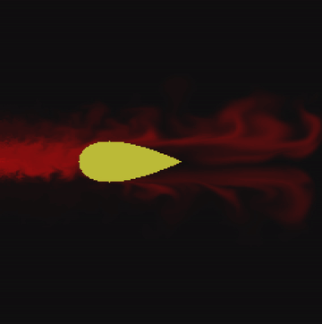

# FluidSim

A real-time 2D fluid simulation written in C++, implementing Jos Stam's
["Stable Fluids"](https://www.dgp.toronto.edu/people/stam/reality/Research/pdf/GDC03.pdf)
method and a simple obstacle reflection logic.



## Features

- Grid-based incompressible fluid solver (density + velocity fields)
- Solid obstacles with correct boundary reflection, including advection
  that can't sample through walls
- Two modes:
  - **Wind tunnel demo** - a NACA-profile wing sits in a constant airflow;
    dye injected at the inlet traces the flow around it
  - **Freeplay** - click and drag to inject dye and velocity directly

## Building

Requires CMake and SDL2 to compile properly.

```bash
./run.sh
```

## Controls

**Wind tunnel demo** (default) - no controls enabled.

**Freeplay** - set `DEMO_MODE = false` at the top of `main.cpp` and rebuild:

| Input | Action |
|---|---|
| Left click + drag | Add dye and velocity |
| `Space` + left click | Erase dye |
| `Esc` | Quit |

## How it works

Each frame runs two steps:

1. **`vel_step()`** - the velocity field diffuses (viscosity), advects
   itself along its own flow, and is projected back onto a divergence-free
   field so the fluid doesn't compress.
2. **`dens_step()`** - dye diffuses and is advected through the
   now-updated velocity field.

Obstacles are marked cells that reflect velocity and block advection, so
flow correctly separates around solid shapes instead of passing through
them.

## Possible next steps

- Vorticity confinement to keep small vortices from diffusing away too fast
- Temperature to make the convection cells (possible second demo)
- Move the solver to the GPU for a performance boost